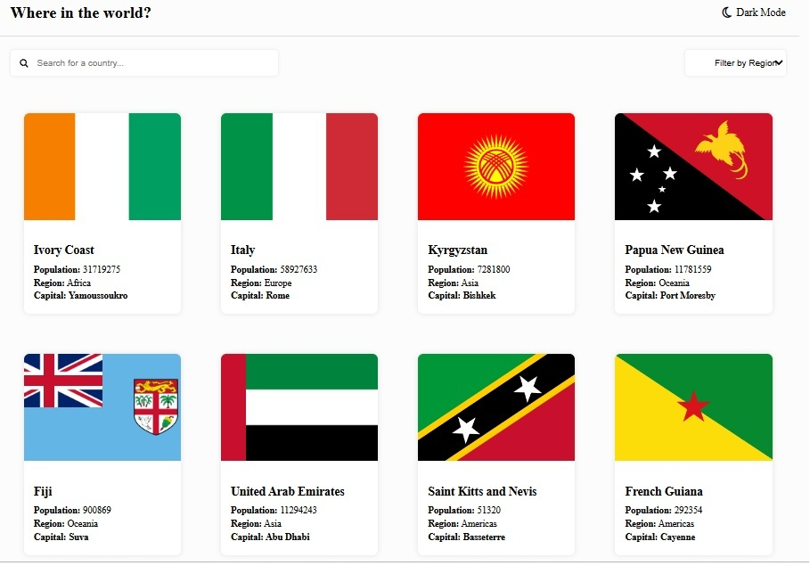
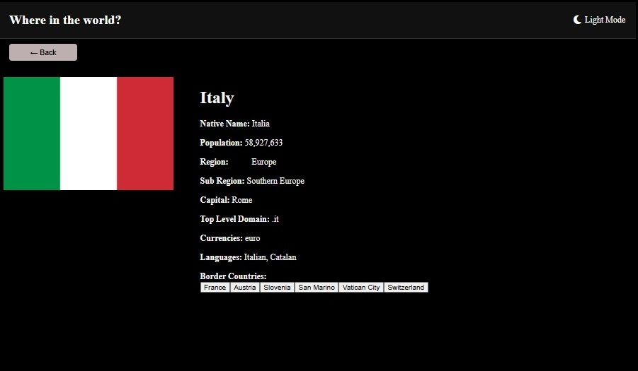
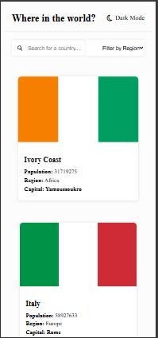

# REST API Countries Project With JS

#### Project Abstract & Setup

This project is a simple frontend web app that shows country details using REST Countries API. It displays all countries in a grid layout with flag, name, population, region, and capital. Clicking on a country opens a detailed page with full information. It also includes a dark mode toggle for better viewing experience. Search and filter features are added to find countries quickly. The project is built using HTML, CSS, and JavaScript. Data is fetched using fetch API and rendered dynamically using DOM manipulation. No frameworks are used. To run the project, open index.html using Live Server or any browser. All files are connected using relative paths.

#### What is REST API & its role here?

REST API is a way to get data from a server using HTTP requests. In this project, REST Countries API is used to fetch real-time country data like name, population, region, capital, flag, languages, and currencies. The API sends data in JSON format. We use JavaScript fetch() method to get this data and display it on the web page. Without API, we would need to manually store all country data. Here API makes the project dynamic and real-time. It helps in search, filter, and detailed view features by providing live structured data.

#### Languages and Styles Used

This project is built using HTML, CSS, and Vanilla JavaScript. Data is fetched using Fetch API and rendered with DOM manipulation. Layout uses Flexbox and CSS Grid with responsive media queries for all devices. Google Font Nunito Sans is used, and dark mode is handled using CSS class toggle for theme switching.

#### Screenshots

##### Desktop Main Page

##### Desktop Details Page Dark Mode

##### Mobile Home Page

#### Project Features

Here are the notable features added to thie Rest API Countries Project

##### Country Grid Display with Card Layout

The main page shows all countries in a grid layout using data from REST Countries API. Each country is displayed as a card. The card contains flag image, country name, population, region, and capital. Everything is generated dynamically using JavaScript DOM manipulation, so nothing is hardcoded.

##### Navigation to Detailed Country Page

Each country card is clickable. When clicked, it opens a separate detailed page for that country. Data is passed through URL parameters and then fetched again using the API. The details page shows full information like native name, currencies, languages, borders, and more. This makes the app behave like a multi-page dynamic system instead of a static page.

##### Search and Region Filter Functionality

A search bar is added to quickly find countries by name. Along with that, a region filter allows users to filter countries based on continents like Asia, Europe, Africa, etc. Both features work together with live data rendering. When user types or selects a region, the grid updates instantly. This improves usability when dealing with large dataset of countries.

##### Accessibility and Keyboard Navigation Support

Accessibility is considered throughout the project. Inputs have proper labels and aria attributes for screen readers. Results update dynamically using aria-live. Cards are made keyboard accessible using tabindex and Enter key support.

##### Dark Mode / Light Mode Toggle

A theme switcher is implemented to toggle between dark and light mode. It uses JavaScript classList toggle on the body element and stores preference using localStorage.

#### Website Deployment using GitHub Pages

This project is deployed using GitHub Pages for hosting the static frontend. The workflow is automated using a GitHub Actions YAML file written in YAML language, which builds and deploys the project on every push to the main branch. This ensures smooth continuous deployment and live updates.

Live Link: https://vidhyadivakar.github.io/REST-Countries-API/

#### Project Reflections

This project helped me understand how real frontend applications work using API data. I started with basic HTML structure and then built the grid layout for countries. The main challenge was handling API data and mapping it correctly to UI elements. I faced issues with undefined values like borders and currencies because the API structure was different from what I expected. Debugging helped me understand JSON structure better.

Another challenge was navigation between pages using URL parameters. I learned how to pass data using query strings and retrieve it using URLSearchParams. Dark mode implementation also needed proper class handling using JavaScript.

I also improved my understanding of DOM manipulation by creating elements dynamically instead of hardcoding HTML. In future improvements, I want to optimize the code using reusable components, add loading states, and improve error handling. I also want to make the UI more polished and closer to production-level design.
